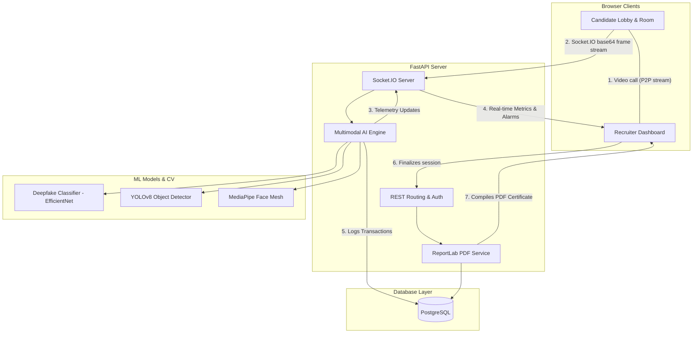
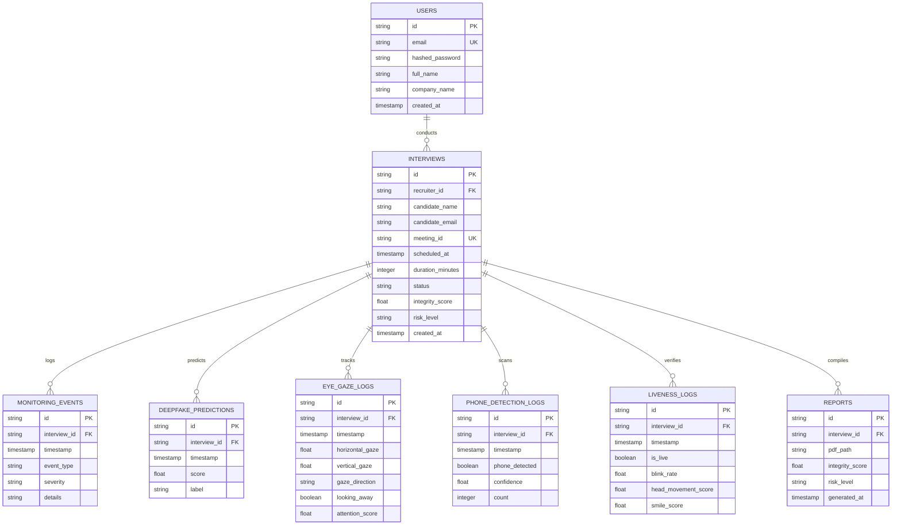
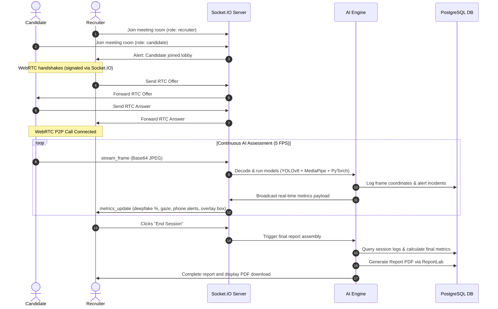

# InterviewGuard AI
> **A Multimodal Framework for Real-Time Deepfake Detection and Interview Integrity Assessment in Live Video Interviews**

InterviewGuard AI is an end-to-end, production-ready full-stack application designed to secure online video interviews. It uses a multimodal deep learning and computer vision framework to continuously evaluate candidate integrity in real-time, detecting face deepfake injects, monitoring gaze offsets, assessing physical liveness indicators, and identifying unauthorized mobile device presence.

---

## 🏛️ System Architecture

The application is structured into decoupled frontend, backend, and machine learning components:



---

## 📊 Database Design (ER Diagram)

The PostgreSQL database holds the following schemas and connections:



---

## 🔄 Sequence Flow Diagram



---

## 🛠️ Installation & Quickstart

InterviewGuard AI can be deployed instantly using Docker Compose or built locally.

### Method 1: Docker Compose (Recommended)

One command spins up the Postgres Database, FastAPI application, and React Client:

```bash
docker-compose up --build
```

- **Frontend Client**: Access at [http://localhost:5173](http://localhost:5173)
- **FastAPI Core**: Access at [http://localhost:8000](http://localhost:8000)
- **Swagger Documentation**: Access at [http://localhost:8000/docs](http://localhost:8000/docs)

### Method 2: Manual Local Build

#### 1. Backend Setup
Make sure Python 3.12+ is installed:

```bash
cd backend
python -m venv venv
source venv/bin/activate  # On Windows: venv\Scripts\activate
pip install -r requirements.txt
python app/main.py
```

*Note: On first startup, the server automatically downloads the COCO-pre-trained YOLOv8 weights (`yolov8n.pt`) and initializes local SQLite database tables if PostgreSQL credentials are left blank.*

#### 2. Frontend Setup
Make sure Node.js is installed:

```bash
cd frontend
npm install
npm run dev
```

---

## 🧠 Multimodal DL Model Pipelines

1. **Face Deepfake Classification (`training/`)**:
   - Model weights training scripts are structured under `training/dataset.py` and `training/train.py`.
   - Incorporates a PyTorch `DeepfakeClassifier` custom CNN backbone which can wrap pre-trained ResNet/EfficientNet models.
   - Evaluates frame inputs returning a decimal float percentage of spoof confidence.
2. **Device Detection (YOLOv8)**:
   - Uses `ultralytics` YOLOv8 nano detector.
   - Filters target detection for COCO class index 67 ("cell phone") with custom confidence thresholds (> 0.4).
3. **Blink, Gaze & Smile Liveness (MediaPipe)**:
   - Uses refined Iris landmarks to track eye aspect ratio (EAR) and gaze vectors (left/right/center).
   - Measures distance deltas for candidate smiles to confirm presence of dynamic expressions.
